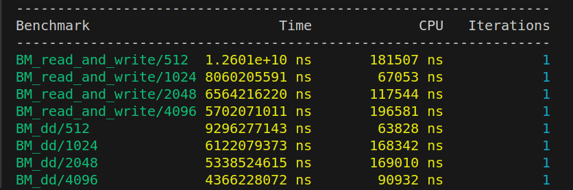

# 1 Basics

We create **rdwr.c** including functions **block_read** and **block_write**. Both of them have 3 parameters: **file_name**,  **block_size**, **block_count**. In **block_read**, we read buf sized **block_size** **block_count** times from the file named **file_name**. And so on in **block_write**.

In **run.c**, we parse the parameters and choose to use **block_read** or **block_write**. We record the start time and the end time to get the runtime.


# 2 Measurement

Firstly, we parse the parameters to get the **file_name** and **block_size**.

Then, we start with **block_count=1**. In each loop, we double **block_count** and run

```c
block_read(file_name, block_size, block_count);
```

We record the runtime and quit the loop when **runtime>5** (second)

Finally, we print **block_size*block_count**  as the **file_size**


**Extra Credit: **learn about the “dd” program in Linux and see how your program's performance compares to it!

We use "dd" to copy 2GB data (**block_size 4096**) from the iso file and compare its runtime with "run". We find that their runtimes are almost the same. "dd" takes 50 seconds and "run" takes 49 seconds totally.


Extra credit: learn about Google Benchmark — see if you can use it.

We've tried Google Benchmark on this part. Benchmark is a light weight library, and it is a bit awkward to use it to calculate a proper file_size. (much simpler just in C code)

However, it is a nice tool to monitor performance. We've included an example below, where we compare `dd` and our implementation of block_read + block_write. `dd` is still slightly faster with different block size. (the format BM_dd/2048 means that dd is tested using block size of 2048 Bytes)




# 3 Raw Performance


After reaching **block_size=**, the runtime won't decrease when **block_size** increases.


# 4 Caching

We clear the cache.

Then read the file twice. Record their runtime and compare them.


**Extra Credit: **Explain `sudo sh -c "/usr/bin/echo 3 > /proc/sys/vm/drop_caches"`

The following comes from the documentation of Linux:

>To free pagecache:
>
>   echo 1 > /proc/sys/vm/drop_caches
>
>To free reclaimable slab objects (includes dentries and inodes):
>
>   echo 2 > /proc/sys/vm/drop_caches
>
>To free slab objects and pagecache:
>
>   echo 3 > /proc/sys/vm/drop_caches

Using 3 remove both the slab objects and pagecache. Slab is a memory management mechanism used in the Linux for commonly used objects. Page cache is part of the VM system. It is a cache of pages in RAM.


# 5 System Calls
- Measure performance MiB/s when using block size of 1 byte

3.680185 MiB/s

- Measure performance in B/s. This is how many system calls you can do per second.

3858954 B/s, or 3858954 systemcalls per second

- Try with other system calls that arguably do even less real work (e.g. lseek)

We have compared system calls read and lseek(system_call.c), here's the printing result:

Number of read per second: 3844769.056968

Number of lseek per second: 10240425.108437

# 6 Raw Performance

In this part we use multiple threads. 

We use the block_size **4096**. (Basely)

For the thread numbered **i**, we open a **fd** and read the blocks numbered

**i, i+num\_threads, ... , i+k*num\_threads**

Use **lseek()** to jump to the right place. After reading, we combine 4 characters into an unsigned int and **XOR** them.

Finally, we output the total runtime (This runtime includes the time to calculate **XOR**), the runtime per MB and the result of **XOR**

For those files whose size is not a multiple of 4, we add '\0' to its tail when **XOR** and make sure each byte is included.

Multiple threads works well. One thread takes approximately 4 times runtime compared to 16 threads.


**Extra Try:**

We try to use **mmap** instead of **read** to input the data but we find that it slows down. It almost takes double time. We guess that under a small **block_size **, **mmap** takes more time when mapping such a small bunch. The code is in **fast_mmap.c**


We also try to increase the **block_size** and find that it makes **fast.c** faster. **block_size 4096** takes approximately 8 times runtime compared to **block_size 65536** ($2^{16}$). After that, the increase of **block_size** hardly cause the development of efficiency.

